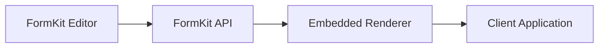

You did mention the Vue renderer in the case study (“Vue renderer powered by the same domain layer”
in _What’s Next_), but it’s framed as **planned**, not shipped. That’s the correct posture. Do
**not** imply parity until it exists.

What you want in the README is:

- clear system positioning
- honest renderer status
- strong architectural signal
- easy “how to run” for reviewers
- visible cross-framework intent (without overpromising)

Below is a **production-ready README** you can drop into the repo.

# FormKit

Schema-driven form infrastructure that separates form creation from form rendering.

FormKit enables product teams to ship form changes instantly while giving engineers a predictable,
accessible, and version-safe runtime. Forms are treated as infrastructure, not scattered UI code.

This repository contains the presentation layer and reference applications. Core domain packages are
published privately.

## Why FormKit exists

Across many SaaS products, forms control critical workflows — onboarding, eligibility, quoting,
intake — yet small changes often require full engineering cycles.

FormKit removes that bottleneck by:

- decoupling form authoring from front-end code
- enforcing accessibility at the schema level
- providing a stable embeddable runtime
- supporting multi-tenant delivery

The goal is faster iteration for product teams without sacrificing engineering rigor.

## System overview

FormKit is composed of three primary layers:

- Visual Editor — create, version, and publish schemas
- FormKit API (NestJS) — stores schemas and enforces rules
- Embedded Renderer — renders forms inside client apps



## Monorepo structure

```
apps/
  formkit-react-app      # React reference implementation
  formkit-vue-app        # Vue renderer (in progress)

```

Note: core domain packages are published privately via npm.

## Current status

**Production-ready**

- React renderer (MVP)
- WCAG enforcement at the model level
- Multi-tenant API support
- Hook-based design system integration

**In progress**

- Schema-driven validation
- Vue renderer powered by the same domain layer
- Advanced conditional logic and branching
- Real-time collaboration in the editor

The architecture is intentionally framework-agnostic so additional renderers can be added without
rewriting domain logic.

## Key architectural decisions

### Framework-agnostic domain

All business logic lives in standalone TypeScript modules. The UI layer consumes the domain rather
than reimplementing behavior.

Result:

- consistent behavior across frameworks
- pure, testable domain logic
- easier long-term evolution

### Hook-based design system integration

FormKit does not ship pre-styled components.

Instead, each field exposes hooks (for example `useFormKitTextNode`) that return fully wired props
for:

- label
- input
- description
- error messaging

This allows teams to plug in their own design system components while preserving validation and
accessibility guarantees.

### Accessibility at the schema level

WCAG requirements are enforced during schema validation rather than relying on ad-hoc component
behavior. This ensures preview and production remain aligned.

## Design goals

FormKit optimizes for:

- predictable state transitions
- accessibility by default
- design-system flexibility
- multi-tenant safety
- versioned schema delivery

It intentionally does **not** aim to be a low-code page builder or visual website editor.

## Relationship to Kurocado Studio

FormKit is part of the broader Kurocado Studio ecosystem, alongside:

- SystemHaus — design token and theming infrastructure
- TypeScript Platform — shared CI/CD and tooling foundation

Together they explore design-driven, production-grade frontend systems.

## License

Private / All rights reserved (update as needed).

## Maintainer

Carlos Santiago Kurocado Studio
